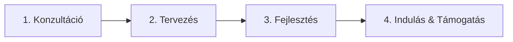

# 👋 Üdvözölünk a Nexodot-nál!

## Digitális élmények építői 🚀

Modern weboldalak, alkalmazások és teljes körű digitális megoldások, amelyek növekedést hoznak vállalkozásodnak.

---

## 📊 Számok, amikre büszkék vagyunk

```
🎯 10+   év tapasztalat
📦 200+  átadott projekt
😊 180+  elégedett ügyfél
🤝 20+   hosszútávú partnerség
```

---

## 💼 Mit csinálunk?

### 🌐 Weboldal fejlesztés
- Egyedi weboldal készítés
- WordPress alapú oldalak
- Webáruház építés
- Vállalatirányítási rendszerek

### 🎨 Grafikai tervezés
- Modern webdesign
- Logó tervezés
- Teljes arculat építés
- Marketing anyagok

### 📱 Alkalmazásfejlesztés
- Android alkalmazások
- iOS mobilappok
- Desktop szoftverek
- Ipari megoldások

---

## 🔄 Így dolgozunk



**1️⃣ Konzultáció** — Megismerjük víziódat, céljaidat és igényeidet

**2️⃣ Tervezés** — Látványterveket készítünk, amit együtt finomítunk

**3️⃣ Fejlesztés** — Megvalósítjuk modern technológiákkal

**4️⃣ Indulás & Támogatás** — Átadjuk a projektet és nyújtunk hosszútávú támogatást

---

## 🏆 Kiemelt partnereink

🎭 **Karinthy Színház** — Modern színházi weboldal foglalási rendszerrel  
🖨️ **Online Toner** — E-commerce platform készletkezeléssel  
💼 **Avantage Management** — Nemzetközi céges portál  
🏭 **Factory Support** — Ipari vállalatirányítási rendszer  
⚡ **Ország Energia** — Energiaipari szakmai weboldal  
🎨 **Pixity** — Kreatív portfólió oldal  

...és még sok más elégedett ügyfél!

---

## 🛠️ Technológiai stack


---

## 📫 Lépj velünk kapcsolatba!

Készen állsz az együttműködésre? Építsük meg együtt a következő sikertörténetet!

📞 **Telefon:** [+36 20 511 4770](tel:+36205114770)  
✉️ **Email:** [info@nexodot.hu](mailto:info@nexodot.hu)  
📍 **Cím:** 1139 Budapest, Forgách utca 20.  
🌐 **Web:** [nexodot.hu](https://nexodot.hu)

---

## 🌐 Közösségi média

[](https://www.facebook.com/nexodot)
[](https://www.instagram.com/nexodot/)
[](https://www.linkedin.com/company/nexodot-kft/)

---

<div align="center">

**Több mint 10 éve nyújtunk professzionális digitális megoldásokat vállalkozások számára.**

*Csapatunk szenvedélyesen alkot modern weboldalakat, alkalmazásokat és komplex rendszereket.*

---

© 2026 Nexodot Kft. | Minden jog fenntartva

</div>
